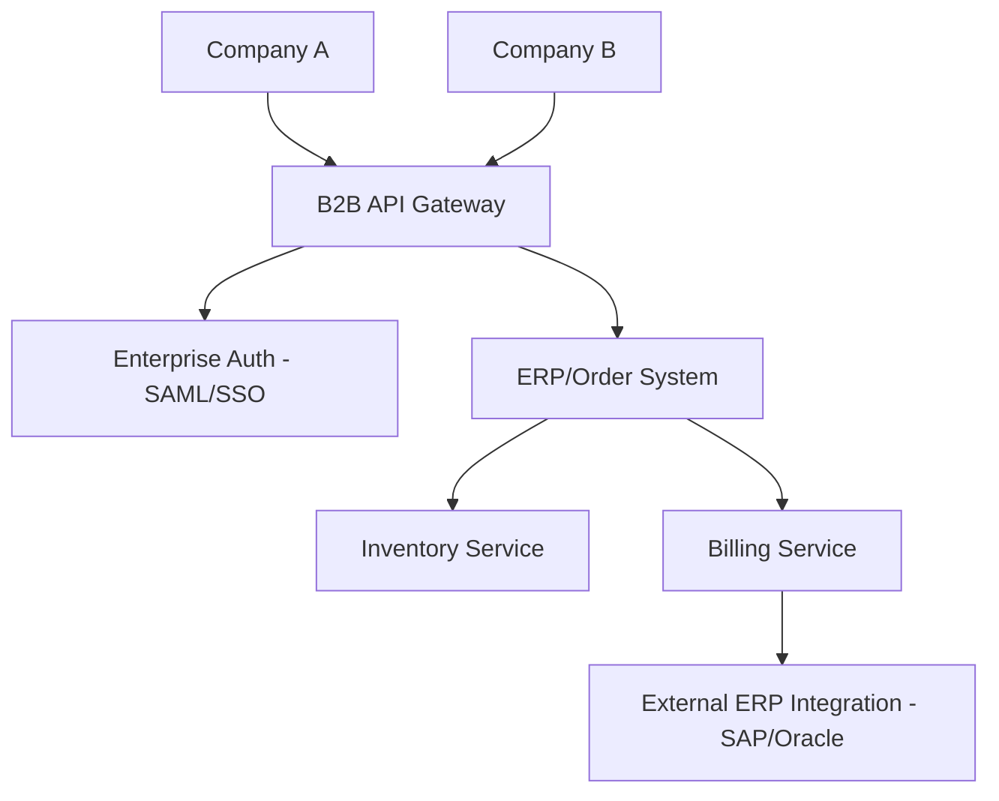

# 🏗️ B2B (Business to Business) Architecture

## Overview
A system designed for inter-company transactions, often requiring complex role-based access control (RBAC) and enterprise integration.

## Diagram

## Workflow
1.  **Auth (SSO)**: Company users sign in via their own corporate identity providers (SAML/ADFS).
2.  **API Gateway**: Manages API keys and quotas for different business partners.
3.  **Order Processing**: Partner sends an order -> Validation -> Inventory Check -> Fulfillment.
4.  **ERP Integration**: Every transaction is synchronized with the back-end ERP systems for financial reporting.

## Key Considerations
- **Bulk Operations**: Handling high-volume data imports/exports.
- **Service Level Agreements (SLA)**: Ensuring high availability and fast response times.
- **Customization**: Ability to provide custom pricing or catalogs per partner.
- **Security**: Robust encryption for data in transit and at rest.
