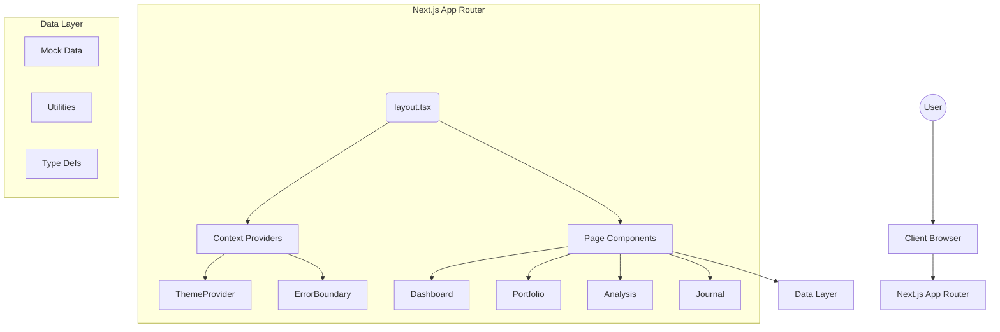

# 🏗 Architecture Documentation: Deriverse Dashboard

## Overview
Deriverse Dashboard is a modern web application built with Next.js 15 (App Router), React 18, and TypeScript. This document provides a detailed overview of the system architecture, design decisions, and implementation patterns.

## Table of Contents
1. [System Architecture](#1-system-architecture)
2. [Directory Structure](#2-directory-structure)
3. [Component Architecture](#3-component-architecture)
4. [Data Layer](#4-data-layer)
5. [State Management](#5-state-management)
6. [Styling Architecture](#6-styling-architecture)
7. [Error Handling](#7-error-handling)
8. [Testing Strategy](#8-testing-strategy)
9. [Performance Considerations](#9-performance-considerations)
10. [Security Measures](#10-security-measures)

## 1. System Architecture
### High-Level Architecture


### Technology Stack
| Layer | Technology | Version | Purpose |
|-------|------------|---------|---------|
| Framework | Next.js | 15.1.0 | Server-side rendering, routing |
| UI Library | React | 18.2.0 | Component-based UI |
| Language | TypeScript | 5.9 | Type safety |
| Styling | Tailwind CSS | 4.1 | Utility-first CSS |
| Charts | Recharts | 2.15 | Data visualization |
| Icons | Lucide React | 0.400 | Icon library |
| Testing | Jest | 30.2 | Unit testing |

## 2. Directory Structure
### Directory Tree
```
deriverse-dashboard/
│
├── app/                              # Next.js App Router
│   ├── layout.tsx                    # Root layout
│   ├── page.tsx                      # Home page
│   ├── globals.css                   # Global styles
│   ├── advanced/page.tsx             # Analysis page
│   ├── journal/page.tsx              # Journal page
│   └── portfolio/page.tsx            # Portfolio page
│
├── components/                       # React Components
│   ├── analysis/                     # Analysis features
│   ├── dashboard/                    # Dashboard widgets
│   ├── filters/                      # Filter controls
│   ├── journal/                      # Journal features
│   ├── layout/                       # Layout components
│   ├── portfolio/                    # Portfolio widgets
│   ├── ui/                           # Reusable UI
│   └── wallet/                       # Wallet integration
│
├── lib/                              # Core library
│   ├── mock-data.ts                  # Mock data
│   ├── types.ts                      # TypeScript types
│   ├── utils.ts                      # Utility functions
│   └── __tests__/                    # Unit tests
│
└── public/                           # Static assets
```

### Directory Responsibilities
| Directory | Responsibility | Naming Convention |
|-----------|----------------|-------------------|
| app/ | Page routing and layouts | page.tsx, layout.tsx |
| components/ | UI components | PascalCase.tsx |
| lib/ | Business logic | kebab-case.ts |
| public/ | Static files | lowercase |

## 3. Component Architecture
### Component Hierarchy
```
RootLayout
├── ThemeProvider
│   └── ErrorBoundary
│       ├── Sidebar
│       │   ├── Navigation Links
│       │   ├── ThemeToggle
│       │   └── User Profile
│       │
│       ├── Main Content
│       │   └── [Page Component]
│       │       ├── Header
│       │       ├── Content Grid
│       │       │   ├── StatsGrid
│       │       │   ├── Charts
│       │       │   └── Tables
│       │       └── Footer
│       │
│       └── BottomNav (Mobile)
```

### Component Categories
#### 1. Layout Components
Located in `components/layout/`

| Component | Purpose | Props |
|-----------|---------|-------|
| Sidebar | Desktop navigation | None |
| BottomNav | Mobile navigation | None |

#### 2. UI Components
Located in `components/ui/`

| Component | Purpose | Key Features |
|-----------|---------|--------------|
| ErrorBoundary | Error handling | Retry functionality |
| Loading | Loading states | Multiple variants |
| ThemeToggle | Theme switching | localStorage sync |

#### 3. Feature Components
Located in feature-specific directories

| Directory | Components | Features |
|-----------|------------|----------|
| dashboard/ | StatsGrid, EquityChart | Metrics display |
| journal/ | JournalTable, AddTradeModal | Trade management |
| portfolio/ | AssetAllocation, RiskMetrics | Portfolio analysis |
| analysis/ | FeeBreakdown, TimeAnalysis | Advanced metrics |

### Component Design Patterns
#### Container/Presentation Pattern
```tsx
// Container: Handles data and logic
function JournalTableContainer() {
  const [trades, setTrades] = useState([]);
  const filteredTrades = filterTrades(trades);
  
  return <JournalTablePresentation trades={filteredTrades} />;
}

// Presentation: Pure UI rendering
function JournalTablePresentation({ trades }) {
  return <table>...</table>;
}
```

#### Compound Components Pattern
```tsx
<Modal>
  <Modal.Header>Title</Modal.Header>
  <Modal.Body>Content</Modal.Body>
  <Modal.Footer>Actions</Modal.Footer>
</Modal>
```

## 4. Data Layer
### Data Flow Diagram
┌──────────────┐      ┌──────────────┐      ┌──────────────┐
│  mock-data.ts │────▶│   utils.ts   │────▶│  Component   │
│              │      │              │      │              │
│ • trades     │      │ • calculate  │      │ • render     │
│ • assets     │      │ • filter     │      │ • display    │
│ • fees       │      │ • format     │      │              │
└──────────────┘      └──────────────┘      └──────────────┘

### Type Definitions
```typescript
// Core trade data structure
interface TradeData {
  id: string;
  pair: string;
  side: 'LONG' | 'SHORT';
  size: string;
  entry: number;
  exit: number;
  fee: number;
  pnl: number;
  date: string;
  entryTime: string;
  exitTime: string;
  duration: number;
  notes: string;
  tags: string[];
  volume: number;
}
```

### Utility Functions Architecture
`utils.ts`
- **Formatting Layer**: `formatCurrency()`, `formatPercentage()`, `formatDuration()`, `getProfitColor()`
- **Calculation Layer**: `calculateWinRate()`, `calculateProfitFactor()`, `calculateAverageDuration()`, `calculateTotalVolume()`, `getBestAndWorstTrade()`
- **Filter Layer**: `filterTradesBySymbol()`, `filterTradesByDateRange()`, `getUniqueSymbols()`

## 5. State Management
### State Categories
| Category | Solution | Scope | Persistence |
|----------|----------|-------|-------------|
| Theme | React Context | Global | localStorage |
| UI State | useState | Component | Memory |
| Form State | useState | Component | Memory |
| URL State | Next.js Router | Page | URL |

### Theme Context Architecture
```typescript
// Provider structure
ThemeContext
├── theme: 'dark' | 'light'
├── toggleTheme: () => void
└── mounted: boolean

// Usage
const { theme, toggleTheme } = useTheme();
```

## 6. Styling Architecture
### CSS Custom Properties
```css
/* Theme variables in globals.css */
:root {
  /* Colors */
  --color-primary: #f2b90d;
  --color-profit: #10B981;
  --color-loss: #EF4444;
  
  /* Backgrounds */
  --bg-primary: #0F0F0F;
  --bg-surface: #1A1A1A;
  
  /* Typography */
  --font-display: "Space Grotesk";
  --font-body: "Inter";
  --font-mono: "Roboto Mono";
  
  /* Shadows */
  --shadow-neobrutal: 4px 4px 0px 0px rgba(0,0,0,1);
}
```

### Design Tokens
| Token | Dark | Light |
|-------|------|-------|
| --bg-primary | #0F0F0F | #F8F8F5 |
| --bg-surface | #1A1A1A | #FFFFFF |
| --text-primary | #FFFFFF | #1F2937 |
| --text-secondary | #9CA3AF | #6B7280 |
| --border-color | #333333 | #E5E7EB |

## 7. Error Handling
### Error Boundary Pattern
```tsx
class ErrorBoundary extends Component {
  state = { hasError: false, error: null };

  static getDerivedStateFromError(error) {
    return { hasError: true, error };
  }

  componentDidCatch(error, errorInfo) {
    console.error('Error caught:', error, errorInfo);
  }

  render() {
    if (this.state.hasError) {
      return <ErrorFallback onRetry={this.handleRetry} />;
    }
    return this.props.children;
  }
}
```

## 8. Testing Strategy
### Test Pyramid
```
         ┌───────────┐
         │    E2E    │  (Future)
         │   Tests   │
        ┌┴───────────┴┐
        │ Integration │  (Future)
        │    Tests    │
       ┌┴─────────────┴┐
       │  Unit Tests   │  ✅ Implemented
       │  (20+ tests)  │
       └───────────────┘
```

## 9. Performance Considerations
| Technique | Implementation |
|-----------|----------------|
| Code Splitting | Next.js automatic |
| Lazy Loading | Dynamic imports |
| Memoization | useCallback, useMemo |
| Debouncing | Search input |

## 10. Security Measures
| Attack Vector | Protection |
|---------------|------------|
| XSS | Regex character filtering |
| Injection | Input length limits |
| CSRF | Next.js built-in |

---
*Last updated: January 29, 2026*
