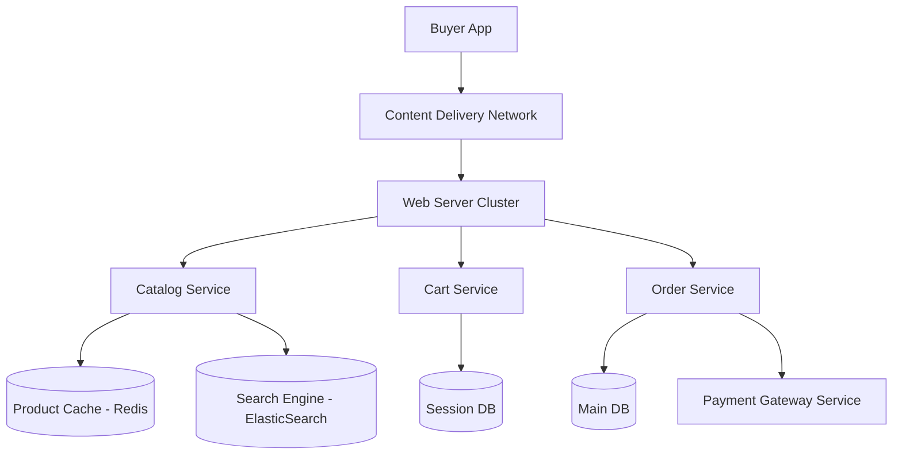

# 🏗️ E-commerce Platform Architecture

## Overview
A high-traffic system designed for catalog management, shopping carts, and order fulfillment.

## Diagram

## Workflow
1.  **Search & Browse**: Buyer searches for products -> Search Engine (ElasticSearch) provides fast results.
2.  **Cart Management**: Adding items to the cart -> State saved in Session DB (Redis) for low latency.
3.  **Checkout**: Order Service calculates taxes, shipping, and total cost.
4.  **Payment**: Integration with external Payment Gateways (Stripe/PayPal).
5.  **Analytics**: Tracking user behavior for personalized recommendations.

## Key Considerations
- **Concurrency**: Handling flash sales and high traffic spikes.
- **Inventory Sync**: Ensuring stock levels are accurate in real-time.
- **Zero-Downtime**: Deployments should not interrupt the shopping experience.
- **Mobile First**: Optimized for slow mobile networks and smaller screens.
