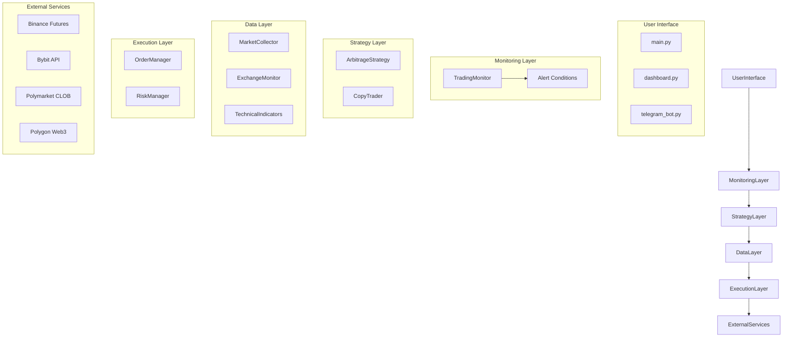

# 🏗️ Architecture Documentation: LiquidityHawk

## System Overview
LiquidityHawk is a modular Python-based trading bot designed for real-time market analysis and signal generation. The architecture follows a layered approach with clear separation of concerns.

## Module Details
### 1. Configuration (`src/config.py`)
Central configuration management using dataclasses and environment variables.

### 2. Data Layer
- **ExchangeTracker**: Fetches real-time data from Binance and Bybit.
- **TechnicalIndicators**: RSI, Williams %R calculation.
- **MarketCollector**: Polymarket-specific order book and market data.

### 3. Monitoring Layer
- **TradingMonitor**: Centralized alert logic for Oversold/Overbought levels and L/S ratios.
- **TelegramAlertBot**: Formatted alerts sent directly to Telegram.

### 4. Strategy Layer
- **ArbitrageStrategy**: Detects and executes risk-free arbitrage on Polymarket YES/NO tokens.
- **CopyTrader**: Monitors specific wallets on-chain and replicates trades.

### 5. Execution Layer
- **OrderManager**: Handles API interaction for placing/cancelling orders (Limit, Market, FOK).
- **RiskManager**: Enforces position sizing, daily loss limits, and emergency stops.

## Technology Stack
| Component | Technology |
|-----------|------------|
| Language | Python 3.10+ |
| Web Framework | FastAPI + Uvicorn |
| HTTP Client | httpx (async) |
| Blockchain | web3.py |
| CLI | Click + Rich |
| Config | python-dotenv |

---
*Architecture Version: 1.0.0*
