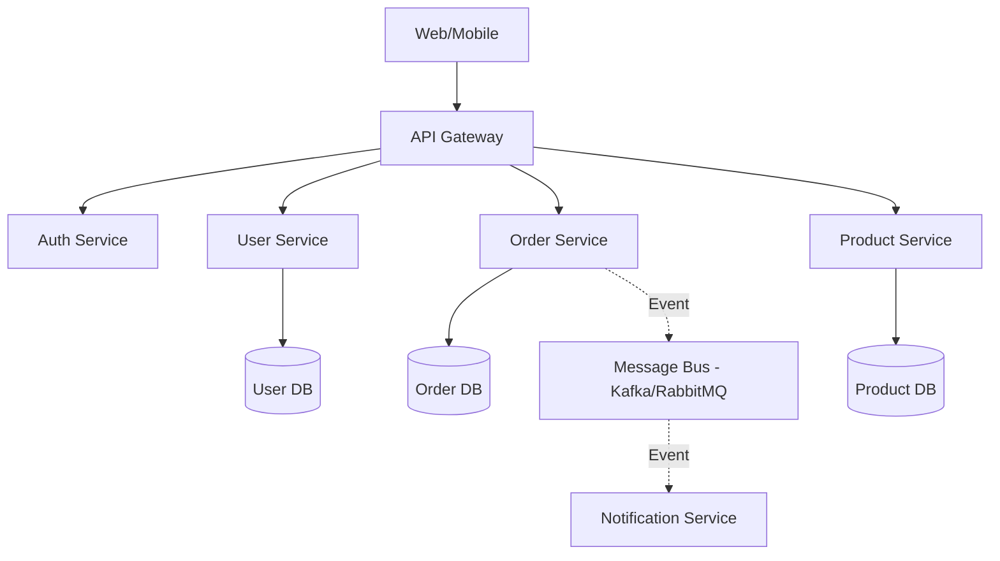

# 🏗️ Microservices Architecture

## Overview
A distributed system architecture where independent services communicate over the network.

## Diagram

## Workflow
1.  **Request Routing**: API Gateway receives a request and routes it to the specific service.
2.  **Service Discovery**: Services register themselves with a Discovery Service (e.g., Consul, Eureka) for dynamic communication.
3.  **Data Consistency**: Uses a "Database per Service" pattern. Cross-service consistency is handled via events (Saga pattern).
4.  **Deployment**: Each service is containerized (Docker) and managed by an orchestrator (Kubernetes).

## Key Considerations
- **Failure Resilience**: Components like Circuit Breakers (Resilience4j) prevent cascading failures.
- **Monitoring**: Centralized logging (ELK) and tracing (Jaeger) are essential.
- **Complexity**: Harder to manage than monodisciplinary apps but offers better scalability and team decoupling.
