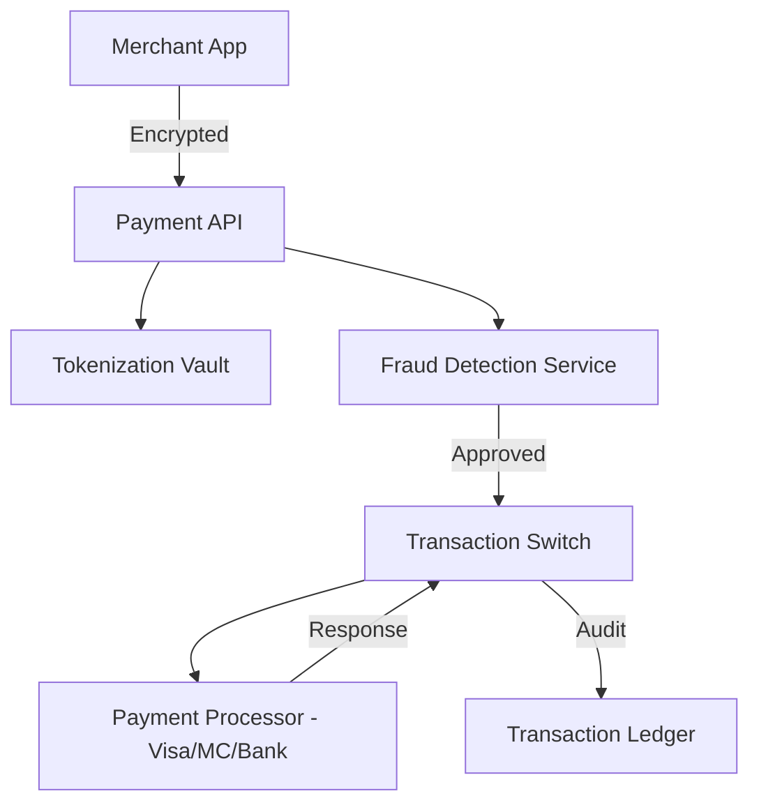

# 🏗️ Payment Gateway Architecture

## Overview
A secure, compliant system for processing financial transactions between merchants and banks.

## Diagram

## Workflow
1.  **Initialization**: Merchant sends transaction details -> API receives and encrypts data.
2.  **Tokenization**: Sensitive card data is stored in a secure Vault and replaced with a non-sensitive Token.
3.  **Scrubbing**: Fraud Detection analyzes the transaction (IP, History, Pattern).
4.  **Authorization**: Request is sent to the Payment Processor or Bank.
5.  **Settlement**: Funds are cleared and the Transaction Ledger is updated for record-keeping.

## Key Considerations
- **Compliance (PCI DSS)**: Adhering to strict security standards for handling credit card data.
- **Idempotency**: Ensuring a payment isn't processed twice due to network errors.
- **Atomic Transactions**: Ensuring "All or Nothing" operations to prevent data corruption.
- **Scalability**: Capable of handling peaks during holiday seasons.
