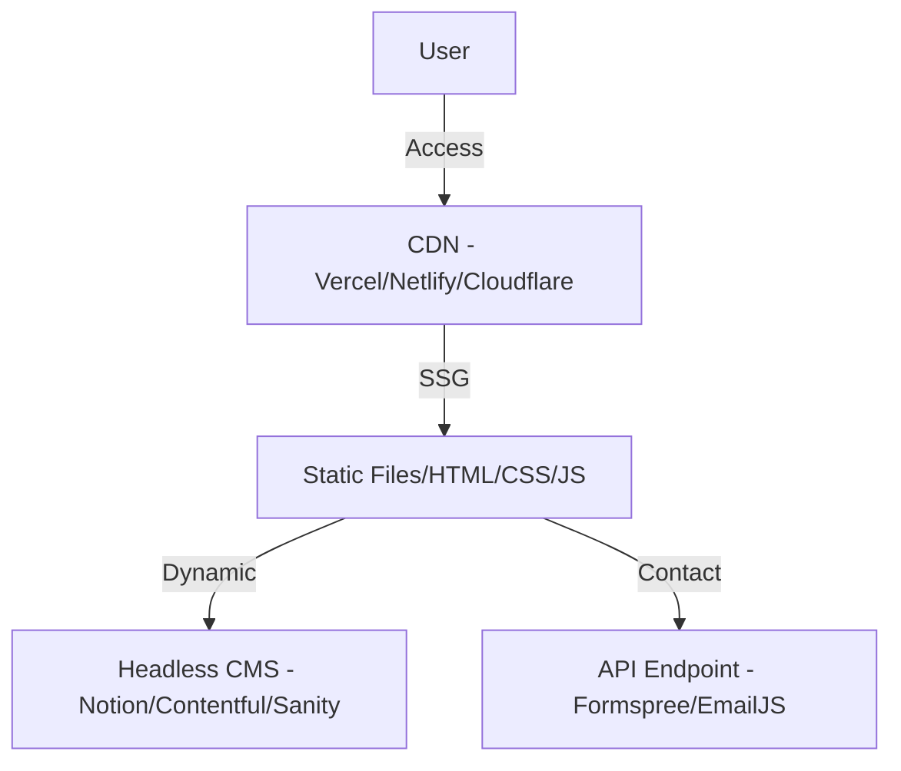

# 🏗️ Portfolio Website Architecture

## Overview
A static or lightly dynamic website for showcasing personal work and identity.

## Diagram

## Workflow
1.  **Develop**: Code is written in React/Next.js/HTML.
2.  **Content Management**: Projects/Blogs are updated in a Headless CMS.
3.  **CI/CD**: Git Push triggers a build -> Build fetches content from CMS -> Uploaded to CDN.
4.  **Static Site Generation (SSG)**: Entire site is pre-rendered for maximum speed.

## Key Considerations
- **Performance**: High performance scores (Lighthouse) are critical.
- **Analytics**: Track visitor traffic for reach measurement.
- **Social Integration**: Open Graph tags for better social sharing.
- **SEO**: Meta tags and structured data (JSON-LD) for better search visibility.
