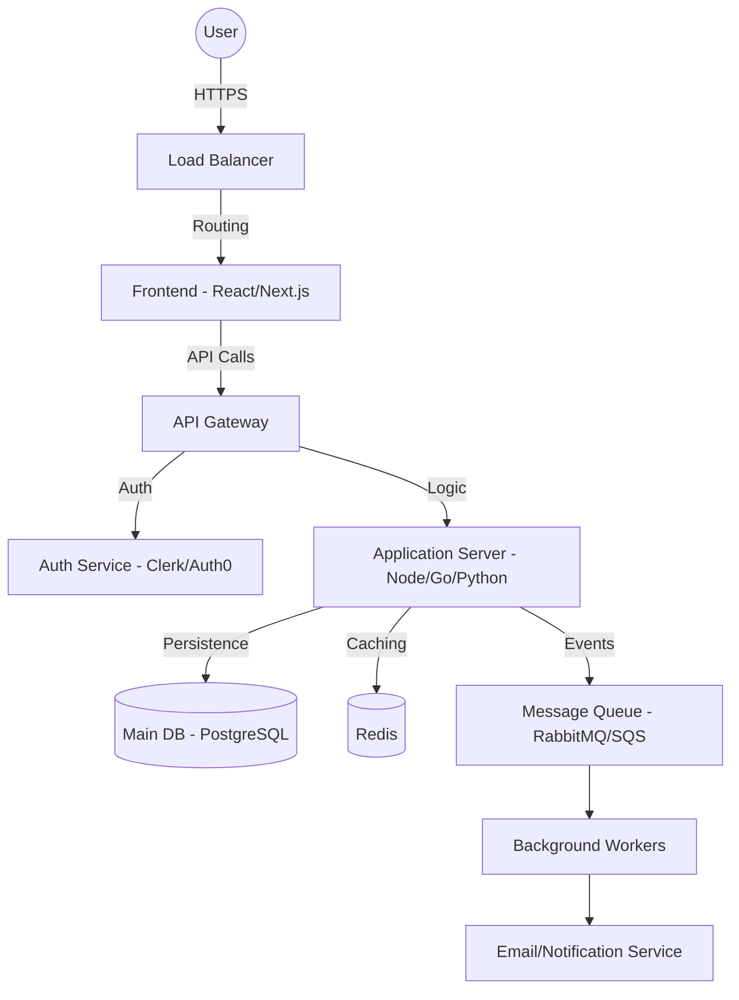

# 🏗️ SaaS (Software as a Service) Architecture

## Overview
A scalable, multi-tenant SaaS architecture designed for cloud deployment.

## Diagram

## Workflow
1.  **Onboarding**: User signs up -> Auth Service creates identity -> DB creates Tenant record.
2.  **Request Flow**: Request -> LB -> API Gateway (checks JWT) -> App Server.
3.  **Multi-tenancy**: Every DB query includes `tenant_id` to ensure data isolation.
4.  **Subscription**: Stripe integration handles billing cycles; webhooks update subscription status in DB.

## Key Considerations
- **Data Isolation**: Logical (shared DB, different IDs) vs. Physical (different DBs).
- **Rate Limiting**: Applied at API Gateway to prevent abuse.
- **Tenant Analytics**: Track usage per tenant for billing and optimization.
