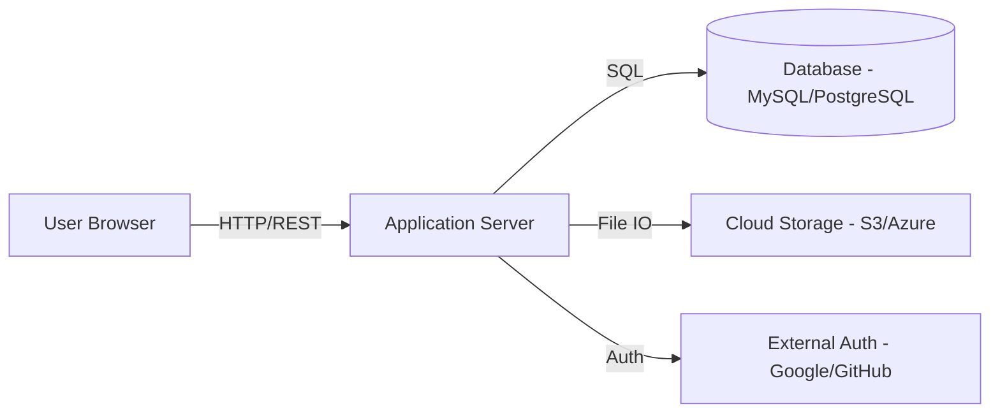

# 🏗️ Web App Architecture (Standard)

## Overview
A typical 3-tier web application architecture suitable for personal or business apps.

## Diagram

## Workflow
1.  **Rendering**: Frontend (Next.js/React) renders the UI.
2.  **Interaction**: User clicks a button -> Client sends API request to Server.
3.  **Business Logic**: Server-side logic processes the request, validates data.
4.  **Persistence**: Data is saved or fetched from the Database.

## Key Considerations
- **SSR vs. CSR**: Choose Server-Side Rendering (Next.js) for SEO and initial load speed.
- **Form Validation**: Client-side (for UX) and Server-side (for Security) validations.
- **REST APIs**: Standard method for communication.
- **Responsive Design**: Ensure mobile-first approach.
